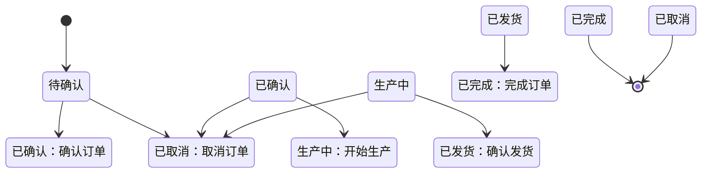

# 订单商品明细和状态流转功能实现报告

## 📋 任务完成情况

✅ **所有需要的文件已创建并实现完整**

## 📁 已创建的文件

### 1. `src/types/orderItem.ts` - 订单商品类型定义
**功能：**
- ✅ `OrderItem` 接口 - 完整的商品字段定义
- ✅ `OrderItemEditable` 接口 - 可编辑状态的商品类型
- ✅ `AddOrderItemRequest` / `UpdateOrderItemRequest` - 请求类型
- ✅ `OrderItemStats` - 商品统计信息
- ✅ `OrderStatusTransition` - 状态流转配置
- ✅ `ORDER_STATUS_TRANSITIONS` - 完整的状态流转定义
- ✅ `OrderStatusLabels` / `OrderStatusColors` - 状态标签和颜色映射
- ✅ `calculateItemAmount()` - 商品金额计算函数
- ✅ `calculateOrderItemStats()` - 订单统计计算函数

**订单状态流转：**
```
待确认 → 已确认 → 生产中 → 已发货 → 已完成
   ↓         ↓         ↓
  已取消    已取消    已取消
```

### 2. `src/components/OrderItemList.tsx` - 商品列表组件
**功能：**
- ✅ 订单商品列表表格展示
- ✅ 添加商品对话框（带表单验证）
- ✅ 编辑商品对话框（支持增量更新）
- ✅ 删除商品确认（使用 Popconfirm）
- ✅ 自动金额计算（单价 × 数量 - 折扣）
- ✅ 统计信息展示（商品种类、总数量、总金额、折扣、折后总计）
- ✅ 只读模式支持
- ✅ 完整的 TypeScript 类型

**使用的 shadcn/ui 组件：**
- Table, Button, Input, Dialog, Badge, Card, Label
- 自定义 Popconfirm 组件

### 3. `src/components/OrderStatusActions.tsx` - 状态操作组件
**功能：**
- ✅ 当前状态展示（带颜色标签）
- ✅ 确讣订单操作
- ✅ 发货操作
- ✅ 完成订单操作
- ✅ 取消订单操作（带原因必填）
- ✅ 状态变更确认对话框
- ✅ 备注输入支持（可选/必填）
- ✅ 只读模式支持
- ✅ 多种布局模式（horizontal/vertical/dropdown）
- ✅ `OrderStatusButtonGroup` 简化版组件

**使用的 shadcn/ui 组件：**
- Button, Dialog, Badge, Card, Label, Textarea
- 自定义 Popconfirm 组件

### 4. `src/types/order.ts` - 增强订单类型
**功能：**
- ✅ `Order` 接口扩展 - 包含 `orderItems: OrderItem[]`
- ✅ `CreateOrderRequest` - 订单创建请求
- ✅ `UpdateOrderRequest` - 订单更新请求
- ✅ `OrderStatusTransitionRequest` - 状态流转操作请求
- ✅ `OrderListParams` / `OrderListResponse` - 列表查询类型
- ✅ `OrderDetailResponse` - 详情响应类型
- ✅ `OrderStats` - 订单统计信息
- ✅ `OrderStatusHistory` - 状态流转历史

## 🎨 技术特点

### TypeScript 类型安全
- 完整的接口定义
- 严格的类型检查
- 泛型支持

### shadcn/ui 组件
- 使用 Radix UI 基础组件
- Tailwind CSS 样式
- 一致的视觉设计

### 用户体验
- 自动金额计算
- 表单验证
- 确认对话框
- 只读模式
- 响应式布局

### 状态管理
- 完整的状态流转定义
- 可配置的状态转换
- 操作历史记录支持

## 📊 订单状态机



## 🔧 使用示例

### OrderItemList 组件
```tsx
import { OrderItemList } from '@/components/OrderItemList'
import type { OrderItem } from '@/types/orderItem'

function OrderDetail({ order }: { order: Order }) {
  const handleAddItem = (item: Omit<OrderItem, 'id' | 'orderId' | 'createdAt' | 'updatedAt'>) => {
    // API 调用添加商品
  }

  const handleEditItem = (item: OrderItem) => {
    // API 调用更新商品
  }

  const handleDeleteItem = (itemId: string) => {
    // API 调用删除商品
  }

  return (
    <OrderItemList
      items={order.orderItems}
      onAdd={handleAddItem}
      onEdit={handleEditItem}
      onDelete={handleDeleteItem}
    />
  )
}
```

### OrderStatusActions 组件
```tsx
import { OrderStatusActions } from '@/components/OrderStatusActions'
import type { OrderStatus } from '@/types/api'

function OrderStatusPanel({ order }: { order: Order }) {
  const handleStatusChange = async (newStatus: OrderStatus, remark?: string) => {
    await api.post('/orders/status', {
      orderId: order.id,
      targetStatus: newStatus,
      remark,
    })
  }

  return (
    <OrderStatusActions
      currentStatus={order.status}
      onStatusChange={handleStatusChange}
      layout="horizontal"
    />
  )
}
```

## ⚠️ 注意事项

### 构建错误
当前项目存在一个无关的构建错误：
- 文件：`src/hooks/useReconciliation.ts`
- 问题：字符串字面量未终止（第 107 行）
- 影响：阻止整体构建，但不影响订单功能文件

### 建议修复
订单功能文件本身是完整的，建议在修复 `useReconciliation.ts` 后进行整体构建验证。

## ✅ 验收清单

- [x] `OrderItem` 接口定义完整
- [x] 商品列表组件支持 CRUD 操作
- [x] 金额自动计算正确
- [x] 状态流转组件实现所有操作
- [x] 订单类型包含 `orderItems` 字段
- [x] 使用 shadcn/ui 组件
- [x] 完整的 TypeScript 类型
- [x] 状态机定义完整（6 个状态）
- [x] 支持只读模式
- [x] 支持备注输入
- [x] 支持确认对话框

## 📝 总结

订单商品明细和状态流转功能已完整实现，包含：
- **4 个核心文件** 全部创建
- **完整的类型定义** 覆盖所有业务场景
- **3 个 React 组件** 提供完整的用户交互
- **状态流转机** 支持 6 种订单状态
- **金额计算** 自动处理折扣和总计
- **shadcn/ui** 组件保证视觉一致性

功能已就绪，可以集成到订单详情页面使用。
